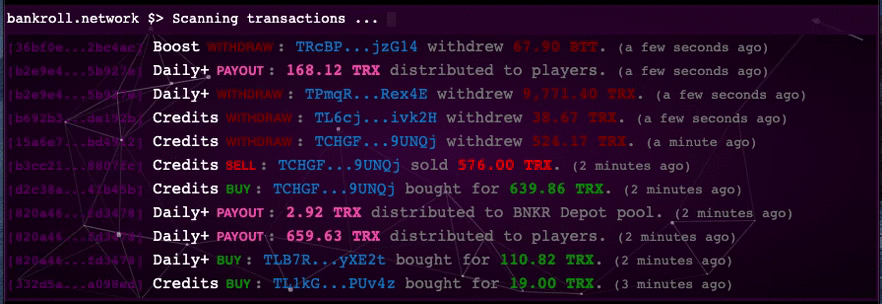

# Bankroll Logs

Bankroll logs is a jquery plugin that display bankroll network smart contract events in a terminal style way.



[Try the live demo !](https://fcojean.github.io/tron-bankroll-logs)

## How to use it

### 1. Include plugin and dependencies JavaScript files 

#### Load the dependencies libraries in this minimal version or above :

| Library   | Minimal version |
| --------- | --------------- |
| jQuery    | 3.3.1           |
| lodash    | 4.17.15         |
| moment    | 2.24.0          |
| numeral   | 2.0.6           |
| particles | 2.0.0           |
| tronweb   | 2.10.1          |

```
<script src="https://code.jquery.com/jquery-3.3.1.min.js"
            integrity="sha256-FgpCb/KJQlLNfOu91ta32o/NMZxltwRo8QtmkMRdAu8=" crossorigin="anonymous"></script>
<script src="https://cdn.jsdelivr.net/npm/lodash@4.17.15/lodash.min.js"
            integrity="sha256-VeNaFBVDhoX3H+gJ37DpT/nTuZTdjYro9yBruHjVmoQ=" crossorigin="anonymous"></script>
<script src="https://cdn.jsdelivr.net/npm/moment@2.24.0/moment.min.js"></script>
<script src="https://cdnjs.cloudflare.com/ajax/libs/numeral.js/2.0.6/numeral.min.js"></script>
<script src="https://cdn.jsdelivr.net/npm/particles.js@2.0.0/particles.min.js"></script>
<script src="https://cdn.jsdelivr.net/npm/tronweb@2.10.1/dist/TronWeb.js" integrity="sha256-yTGcZoX5gMrnHm+NWm4l0Zh3pIr0Nlth+EOXNnmEVFI=" crossorigin="anonymous"></script>
```
> If you don't want to use the particle effect, you can remove the `particles.min.js` dependency and set the `particles` plugin option to `false`.

#### Load the plugin

```
<script src="js/jquery.bankroll-logs.js"></script>
```

### 2. Include CSS file

```
<link rel="stylesheet" href="./css/jquery.bankroll-logs.css">
```

### 3. Call the plugin in your JS code

Create a div and apply the jquery plugin on it.

```
<div id="logs-with-particles"></div>
<script>$("#logs-with-particles").bankroll_logs();</script>
```

### 4. Style the container div element

Give an height property to the container div element.

```
<style>
    /* Target the div where the plugin is applied  */
    #logs-with-particles {
        height: 300px;
    }
</style>
```

## Plugin options

| Option                      | Type    | Default value   | Description |
| --------------------------- | ------- | --------------- | ----------- |
| balanceReportLimit          | Number  | 10              | Displayed contract event number before reporting contract balances. |
| particles                   | Boolean | true            | Enable the particle effect in terminal background. |
| firstRenderFetchEventNumber | Number  | 3               | Event number to fetch from blockchain for the first render. |
| contractsConfiguration      | Object  | See source code | **(Not implemented yet)** Allow to provide a custom contract configuration object. | 

### Example :

```
<script>$("#logs-with-particles").bankroll_logs({balanceReportLimit:5, particles:false});</script>
```

## Contract configuration

### splitEventList

## Contracts information

### Boost contract information

* Event fetch URL : https://api.tronex.io/events/TMmWrjjKGRCdoUzmv6YUaov7mwxy1swDnq
* TronScan page : https://tronscan.org/#/contract/TMmWrjjKGRCdoUzmv6YUaov7mwxy1swDnq/code

#### Events

| Event name           | Action                | Hidden |
| -------------------- | --------------------- | ------ |
| onLeaderBoard        |                       | Yes    |
| onTokenPurchase      | Buy                   |        |
| onTokenSell          | Sell                  |        |
| onReinvestment       | Roll                  | Yes    |
| onWithdraw           | Withdraw              |        |
| onBalance            | Contract balance      | Yes    |
| onDonation           | Donate                |        |
| OwnershipTransferred | Transfer ownership    | Yes    |


### Credits contract information

* Event fetch URL : https://api.tronex.io/events/TUTik4srgKuzgXoL4KfV75foQbYuP8SirY
* TronScan page : https://tronscan.org/#/contract/TUTik4srgKuzgXoL4KfV75foQbYuP8SirY/code

#### Events

| Event name           | Action                | Hidden |
| -------------------- | --------------------- | ------ |
| onTokenPurchase      | Buy                   |        |
| onTokenSell          | Sell                  |        |
| onReinvestment       | Roll                  | Yes    |
| onWithdraw           | Withdraw              |        |
| onTransfer           | Transfer              |        |
| onDonation           | Donate                |        |
| OwnershipTransferred | Transferred ownership | Yes    |

### Daily+ contract information

* Event fetch URL : https://api.tronex.io/events/THVYLtjFbXNcXwDvZcwCGivS95Wtd4juFn
* TronScan page : https://tronscan.org/#/contract/THVYLtjFbXNcXwDvZcwCGivS95Wtd4juFn/code

#### Events

| Event name           | Action                            | Hidden |
| -------------------- | --------------------------------- | ------ |
| onLeaderBoard        |                                   |  Yes   |
| onTokenPurchase      | Buy                               |        |
| onTokenSell          | Sell                              |        |
| onReinvestment       | Roll                              | Yes    |
| onWithdraw           | Withdraw                          |        |
| onTransfer           | Transfer                          |        |
| onBalance            | Contract balance                  | Yes    |
| onDonation           | Donate                            |        |
| onDistribution       | Distribute payout (Profit, depot) |        |
| OwnershipTransferred | Transferred ownership             | Yes    |


### Air contract information

* Event fetch URL : https://api.tronex.io/events/TBbdx9G136y5Bf3cPipYQPkq4iukNEvZMn
* TronScan page : https://tronscan.org/#/contract/TBbdx9G136y5Bf3cPipYQPkq4iukNEvZMn/code

#### Events

| Event name           | Action                | Hidden |
| -------------------- | --------------------- | ------ |
| onPlayerSummary      | Free Roll             |        | 
| onRoundSummary       | Win                   |        |
| OwnershipTransferred | Transferred ownership | Yes    |

### BNKR token contract information

* Event fetch URL : https://api.tronex.io/events/TNo59Khpq46FGf4sD7XSWYFNfYfbc8CqNK
* TronScan page : https://tronscan.org/#/contract/TNo59Khpq46FGf4sD7XSWYFNfYfbc8CqNK/code

#### Events

| Event name           | Action                | Hidden                                      |
| -------------------- | --------------------- | ------------------------------------------- |
| Mint                 | Token are mined       | Yes if BNKR mined amount is under 0.01 BNKR |
| MintFinished         |                       | Yes                                         |
| OwnershipTransferred | Transferred ownership | Yes                                         |
| Approval             | Approve staking       | Yes                                         |
| Transfer             | Stake token           | Yes if it come from the ZERO address        |

**Note :** for `Transfer` event :

> When tokens come from the ZERO address (0x0000000000000000000000000000000000000000 or T9yD14Nj9j7xAB4dbGeiX9h8unkKHxuWwb) they are mined.

> When tokens are sent to the stake address (TXwYAQ9y9r8u4E2o6KrdeELMr5x6NFekge) they are staked.

### Save contract information


* Event fetch URL : https://api.tronex.io/events/THjY7rDKfjMiyCFMoCMCXdQAtRakD21RZQ
* TronScan page : https://tronscan.org/#/contract/THjY7rDKfjMiyCFMoCMCXdQAtRakD21RZQ/code

#### Events

| Event name                | Action                       | Hidden |
| ------------------------- | ---------------------------- | ------ |
| onFreeze                  | Deposit                      |        |
| onUnfreeze                | Withdraw                     |        |
| onClaim                   | Claim                        |        |
| onBalance                 | Customer balance             | Yes    |
| onContractBalance         | Contract balance             | Yes    |
| WhitelistedAddressAdded   | Add a whitelisted address    | Yes    |
| WhitelistedAddressRemoved | Remove a whitelisted address | Yes    |
| OwnershipTransferred      | Transferred ownership        | Yes    |

